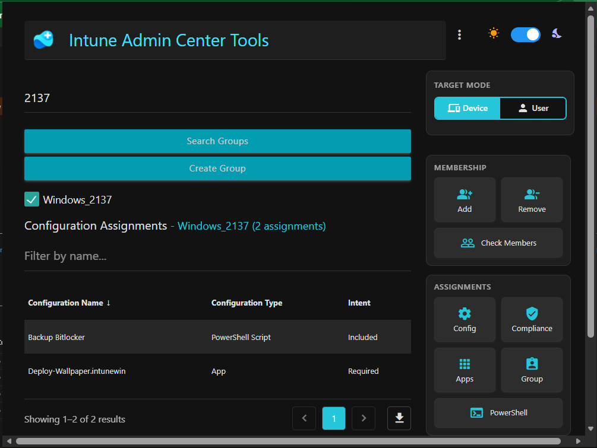
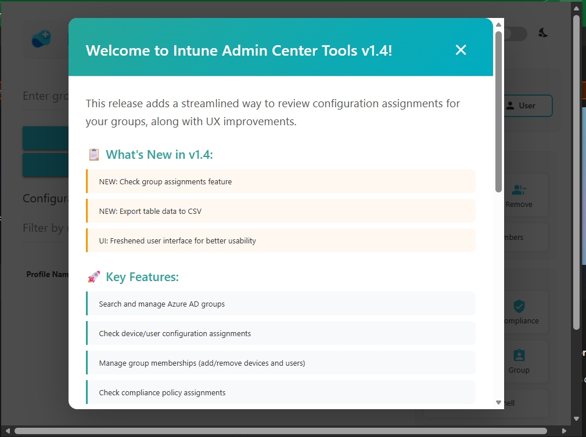

# Intune Admin Center Tools

A powerful browser extension that extends Microsoft Intune Admin Center with essential features for IT administrators. Built openly, without marketing fluff or red tape — just practical tools that save time and streamline device management workflows.

**[📦 Install from Microsoft Edge Store](https://microsoftedge.microsoft.com/addons/detail/intune-admin-center-tools/iglpbhebeofeaiimjejamnicpfdagnhk)**

---

## 🔒 Security Advisory

**IMPORTANT:** This extension retrieves your Graph API token from browser storage and uses it as an Authorization header in Microsoft Graph API requests.

- ✅ **Open Source**: All code is public and auditable
- ⚠️ **Trust but Verify**: Read the code before installing
- 🔐 **Your Responsibility**: Review permissions and understand what you're running
- 📖 **Transparency**: No telemetry, no data collection, no external API calls

This is public software from a developer on the internet. Be cautious and audit before use in production environments.

---

## ✨ Features

### 🔍 Device & User Context Switching
- Toggle between **Device Mode** and **User Mode** to manage either device or user group memberships
- Seamlessly switch context without leaving the extension
- All operations respect the current mode (add/remove from groups, check assignments)

### 👥 Advanced Group Management

#### Search & Assign
- **Search Groups**: Find Azure AD groups by name with real-time filtering
- **Add to Groups**: Assign device or user to multiple groups simultaneously
- **Remove from Groups**: Bulk remove device or user from selected groups
- **Dynamic Group Detection**: Automatically identifies and prevents modifications to dynamic groups

#### Group Analysis
- **Check Group Members**: View all members (devices and users) of a selected group
  - Displays member names, UPNs, device IDs, and types
  - Paginated results for large groups
  - Export to CSV functionality
  
- **Check Group Assignments**: Discover what Intune configurations, policies, and profiles are assigned to a specific group
  - Configuration Policies (Settings Catalog)
  - Device Configurations (Legacy profiles)
  - Administrative Templates (Group Policy)
  - Compliance Policies
  - Mobile Apps
  - PowerShell Scripts
  - Shell Scripts (macOS)
  - **Security Baselines** (Settings Catalog & Legacy Intent-based)
  - **Enrollment Restrictions** (Device Limits, Platform Restrictions, Windows Hello, ESP, Windows Restore)
  - **Autopilot v2** (Device Preparation profiles with device group support)
  - **Autopilot v1** (Deployment profiles - Entra Join & Hybrid Join)
  - Shows assignment type (Included/Excluded) and intent

#### Group Creation
- **Create New Groups**: Quickly create new Azure AD security groups (non-mail-enabled)
- Configurable group name and description

### 📋 Configuration & Policy Assignments

#### Device Configurations
- View all configuration profiles assigned to the current device
- Shows policy names, assigned groups (direct & transitive), and membership types
- Filter and sort results
- Identify which groups are delivering each configuration

#### Compliance Policies
- Complete compliance policy assignments for the device
- Track inclusion and exclusion group assignments
- See all policies affecting the device

#### Application Assignments
- Comprehensive view of all app assignments
- Shows app names, assignment intent (Required, Available, Uninstall), and target groups
- Includes both device and user-targeted apps
- Filter by app name or group

#### PowerShell Scripts
- List all PowerShell scripts assigned to the device
- View script names, assignment groups, and run contexts
- **Download Script**: Extract and download the actual script content (base64 decoded)
- Perfect for troubleshooting or documentation

### 📊 Advanced Table Features

#### Pagination
- Navigate large datasets with ease
- Configurable items per page (10 items default)
- Smart page controls with quick jump
- Shows current range (e.g., \"Showing 1–10 of 150 results\")

#### Filtering
- Real-time search/filter across all columns
- Instant results as you type
- Filters apply across all data, not just visible page

#### Row Selection
- Select individual rows to see which groups are common across policies
- Visual highlighting of selected rows
- Use selection to identify group overlap across multiple configurations

#### CSV Export
- Export current filtered view to CSV
- All data types supported (configs, apps, compliance, scripts, group members, group assignments)
- Filename includes data type and timestamp
- Preserves multi-value cells (e.g., assigned groups)

### 🎨 User Interface

#### Dark/Light Theme Toggle
- System-wide theme switching with one click
- Persisted preference across sessions
- Optimized contrast for readability in both modes

#### Settings Menu
- **Show Welcome**: Display the welcome notification again
- **Reset Welcome**: Clear welcome notification state
- **Clear Storage**: Remove all cached extension data
- Version information display

#### Keyboard Shortcuts
- **Left Arrow**: Previous page (when pagination active)
- **Right Arrow**: Next page (when pagination active)
- **Ctrl+Shift+W**: Show welcome notification

### 🔧 Diagnostic Tools

#### Collect Device Logs
- Trigger Intune log collection for the current device
- Useful for troubleshooting device issues
- Submits collection request via Microsoft Graph API

---

## 📸 Screenshots

### Main Interface

### Configuration Assignments

### Group Search and Management

### Group Assignments Analysis

### Welcome Screen

---

## 🚀 Installation

### From Microsoft Edge Store (Recommended)
1. Visit the [Intune Admin Center Tools page](https://microsoftedge.microsoft.com/addons/detail/intune-admin-center-tools/iglpbhebeofeaiimjejamnicpfdagnhk)
2. Click **Get** to install
3. Confirm the installation and grant required permissions
4. Extension icon will appear in your browser toolbar

### Manual Installation (Developer Mode)
1. Clone or download this repository
2. Open Edge/Chrome and navigate to `edge://extensions/` or `chrome://extensions/`
3. Enable **Developer mode** (toggle in top right)
4. Click **Load unpacked**
5. Select the extension directory
6. Extension icon will appear in your browser toolbar

---

## 📖 Usage Guide

### Getting Started

1. **Navigate to Intune Admin Center**: Open [https://intune.microsoft.com](https://intune.microsoft.com) and sign in
2. **Open a Device**: Browse to Devices → Windows/iOS/Android → Select a device
3. **Launch Extension**: Click the extension icon in your browser toolbar
4. **First Time**: A welcome notification explains the features

### Basic Workflow

#### Checking What's Assigned to a Device
1. Open the extension on any device page
2. Click **Check Configuration Assignments** to see all config profiles
3. Click **Check Compliance Policies** to see compliance assignments
4. Click **Check App Assignments** to see application deployments
5. Click **Check PowerShell Scripts** to view scripts
6. Use filtering to find specific policies or groups

#### Managing Group Memberships
1. Enter a group name in the search box
2. Click **Search Groups**
3. Select desired groups from the results
4. Click **Add** to add device/user to selected groups
5. Click **Remove** to remove device/user from selected groups
6. Toggle **Device/User mode** to change target context

#### Analyzing a Group
1. Search for the group
2. Select **exactly one** group (checkbox)
3. Click **Check Group Members** to see who/what is in the group
4. OR click **Check Group Assignments** to see what policies are assigned to the group

#### Downloading a PowerShell Script
1. Click **Check PowerShell Scripts**
2. Find the script you want
3. Click **Download Script**
4. Script will be decoded and downloaded as `.ps1` file

---

## 🌐 Browser Compatibility

| Browser | Status | Notes |
|---------|--------|-------|
| **Microsoft Edge** | ✅ Fully Supported | Recommended |
| **Google Chrome** | ✅ Fully Supported | All features working |
| **Brave** | ⚠️ Untested | Should work (Chromium-based) |
| **Opera** | ⚠️ Untested | Should work (Chromium-based) |
| **Firefox** | ❌ Not Supported | Manifest V3 differences |

---

## 🖥️ Platform Support

| Intune Platform | Support Level | Notes |
|-----------------|---------------|-------|
| **Windows** | ✅ Full Support | All features tested and working |
| **iOS/iPadOS** | ⚠️ Partial | Basic features work, some endpoints may differ |
| **Android** | ⚠️ Partial | Basic features work, some endpoints may differ |
| **macOS** | ⚠️ Partial | Includes Shell Scripts support |

Improvements for non-Windows platforms are planned. Feedback welcome!

---

## 🛠️ Technical Details

### Permissions Required
- `webRequest`: Intercept requests to capture Graph API tokens
- `storage`: Store preferences and cached data
- `activeTab`: Access current Intune Admin Center page

### Host Permissions
- `https://graph.microsoft.com/*`: Make Microsoft Graph API calls
- `https://intune.microsoft.com/*`: Access Intune portal data

### API Endpoints Used

The extension queries Microsoft Graph Beta API endpoints including:
- `/deviceManagement/managedDevices`
- `/deviceManagement/deviceConfigurations`
- `/deviceManagement/configurationPolicies`
- `/deviceManagement/groupPolicyConfigurations`
- `/deviceManagement/deviceCompliancePolicies`
- `/deviceManagement/deviceManagementScripts`
- `/deviceManagement/deviceShellScripts`
- `/deviceAppManagement/mobileApps`
- `/deviceManagement/configurationPolicyTemplates` (Security Baselines)
- `/deviceManagement/intents` (Legacy Security Baselines)
- `/deviceManagement/deviceEnrollmentConfigurations` (Enrollment Restrictions, ESP)
- `/deviceManagement/windowsAutopilotDeploymentProfiles` (Autopilot v1)
- `/devices/{id}/memberOf` (Direct group memberships)
- `/devices/{id}/transitiveMemberOf` (Nested group memberships)
- `/groups` (Search and management)

---

## 🐛 Troubleshooting

### Extension Not Working
- **Refresh the page**: Reload the Intune Admin Center page
- **Check console**: Open DevTools (F12) and check for errors
- **Token expiration**: Sign out and sign back into Intune Admin Center
- **Permissions**: Ensure your account has appropriate Intune permissions

### No Data Returned
- **Verify API access**: Ensure you have Graph API permissions
- **Check device context**: Make sure you're on a device detail page
- **Network issues**: Check browser network tab for failed requests

### Groups Not Showing
- **Search accuracy**: Ensure correct group name spelling
- **Permissions**: You need permission to read groups
- **Hidden groups**: Some groups may not be visible to your account

### Clear Extension Data
Settings Menu → Clear Extension Storage → Confirm

This removes all cached data and resets the extension state.

---

## 🤝 Contributing

Contributions, issues, and feature requests are welcome!

### Reporting Issues
- Use [GitHub Issues](../../issues) to report bugs
- Include browser version, OS, and steps to reproduce
- Screenshots help!

### Feature Requests
- Open an issue with the `enhancement` label
- Describe the use case and expected behavior

### Pull Requests
- Fork the repository
- Create a feature branch
- Make your changes
- Submit a PR with clear description

---

## 📜 License

This project is licensed under the MIT License - see the LICENSE file for details.

---

## 🤖 AI Disclaimer

Portions of this extension were built with AI assistance (GitHub Copilot, ChatGPT, Claude). The code has been reviewed and tested, but if something breaks, it might be my fault—or the AI's. Either way, report an issue and we'll fix it together.

---

## 💡 Credits

Created by an IT admin who got tired of clicking through endless Intune menus.

**If this saves you time, consider starring the repo! ⭐**

---

## 📞 Support

- **Issues**: [GitHub Issues](../../issues)
- **Store Page**: [Edge Add-ons Store](https://microsoftedge.microsoft.com/addons/detail/intune-admin-center-tools/iglpbhebeofeaiimjejamnicpfdagnhk)

---

**Made with ☕ and frustration at missing Intune features**
